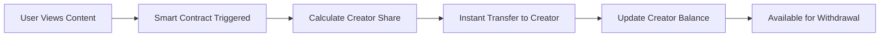

# Pixr Video DeFi System

## Executive Summary

The Pixr Video DeFi System transforms content creation from a monthly payout model to a real-time blockchain economy where:
- Creators earn instantly
- Users can invest in content upgrades
- All transactions are transparent and on-chain
- Security is paramount with 2FA and rate limiting

**"This is the NASDAQ of creativity."**

## Core Architecture

### 1. Deterministic Wallets

Each user gets a unique Solana wallet derived from their user ID and a master key:

```typescript
interface WalletSystem {
  generateDeterministicWallet(userId: string, masterKey: string): SolanaWallet;
  recoverWallet(userId: string, masterKey: string): SolanaWallet;
  getPublicKey(userId: string): PublicKey;
}
```

**Security Features:**
- Private keys never leave the server
- All transfers signed server-side
- Hierarchical Deterministic (HD) wallet structure
- Recovery possible with master key + user ID

### 2. Batch Processing

Efficient batch transfers for multiple earnings:

```typescript
interface BatchProcessor {
  queueEarning(userId: string, amount: number, reason: string): void;
  processBatch(): Promise<BatchResult>;
  optimizeGasFees(): GasOptimization;
}
```

**Optimization Strategies:**
- Aggregate small transactions
- Process during low-gas periods
- Batch similar transaction types
- Minimize on-chain operations

### 3. Smart Reprocessing

Only upgrade video quality, reuse existing analysis:

```typescript
interface SmartReprocessor {
  analyzeUpgradeNeeds(videoId: string, targetQuality: Quality): UpgradeRequirements;
  reuseAnalysis(videoId: string): ExistingAnalysis;
  processUpgrade(videoId: string, investment: Investment): UpgradeResult;
}
```

**Efficiency Features:**
- Preserve existing embeddings
- Reuse transcriptions
- Only process quality improvements
- Incremental upgrades supported

### 4. Secure Architecture

```typescript
interface SecurityLayer {
  enable2FA(userId: string): TwoFactorSetup;
  rateLimit(userId: string, action: string): RateLimitResult;
  auditLog(transaction: Transaction): void;
  encryptSensitiveData(data: any): EncryptedData;
}
```

## Real-Time Creator Economy

### Instant Earnings Flow



### Investment Opportunities

Users can invest in content upgrades:

1. **Quality Upgrades**: Fund higher resolution processing
2. **Feature Enhancements**: Add subtitles, translations
3. **Promotion Boost**: Increase visibility
4. **Creator Support**: Direct creator investment

### Market-Based Valuation

Content value fluctuates based on:
- Search demand
- View velocity
- Investment levels
- Creator reputation

## Implementation Details

### Solana Integration

```javascript
// Wallet generation
async function createUserWallet(userId) {
  const seed = deriveWalletSeed(userId, MASTER_SEED);
  const keypair = Keypair.fromSeed(seed);
  
  return {
    publicKey: keypair.publicKey.toBase58(),
    // Private key stored securely, never exposed
  };
}

// Batch transfer execution
async function executeBatchTransfer(transfers) {
  const transaction = new Transaction();
  
  for (const transfer of transfers) {
    transaction.add(
      SystemProgram.transfer({
        fromPubkey: TREASURY_WALLET,
        toPubkey: new PublicKey(transfer.recipient),
        lamports: transfer.amount * LAMPORTS_PER_SOL
      })
    );
  }
  
  return await sendAndConfirmTransaction(connection, transaction, [treasuryKeypair]);
}
```

### Smart Contract Architecture

```solidity
contract PixrContentEconomy {
    mapping(address => uint256) public creatorBalances;
    mapping(uint256 => ContentMetrics) public contentMetrics;
    
    event EarningsDistributed(address creator, uint256 amount);
    event ContentUpgraded(uint256 contentId, address investor, uint256 amount);
    
    function distributeEarnings(address creator, uint256 amount) external {
        creatorBalances[creator] += amount;
        emit EarningsDistributed(creator, amount);
    }
    
    function investInUpgrade(uint256 contentId, uint256 amount) external {
        // Handle investment logic
        emit ContentUpgraded(contentId, msg.sender, amount);
    }
}
```

### Database Schema

```sql
-- Wallet tracking
CREATE TABLE user_wallets (
    user_id UUID PRIMARY KEY,
    public_key TEXT NOT NULL,
    created_at TIMESTAMP DEFAULT NOW(),
    last_activity TIMESTAMP
);

-- Transaction history
CREATE TABLE transactions (
    id UUID PRIMARY KEY,
    user_id UUID REFERENCES users(id),
    type TEXT CHECK(type IN ('earning', 'investment', 'withdrawal')),
    amount DECIMAL(20, 8),
    solana_tx_id TEXT,
    status TEXT DEFAULT 'pending',
    created_at TIMESTAMP DEFAULT NOW()
);

-- Investment tracking
CREATE TABLE content_investments (
    id UUID PRIMARY KEY,
    content_id UUID REFERENCES content(id),
    investor_id UUID REFERENCES users(id),
    amount DECIMAL(20, 8),
    upgrade_type TEXT,
    return_percentage DECIMAL(5, 2),
    created_at TIMESTAMP DEFAULT NOW()
);
```

## Economic Model

### Creator Earnings Formula

```
Earnings = (Views × SearchRelevance × QualityScore) × BaseRate
```

Where:
- **Views**: Actual view count
- **SearchRelevance**: How well content matches searches (0-1)
- **QualityScore**: Content quality rating (0-1)
- **BaseRate**: Platform-wide earning rate

### Investment Returns

```
Returns = (PostInvestmentEarnings - PreInvestmentEarnings) × InvestorShare
```

### Real-Time Rebalancing

Every transaction triggers:
1. Creator balance update
2. Content valuation adjustment
3. Market metrics recalculation
4. Investment return distribution

## Security Measures

### Multi-Layer Protection

1. **Application Layer**
   - JWT authentication
   - Rate limiting per endpoint
   - Input validation

2. **Blockchain Layer**
   - Multi-sig treasury wallet
   - Transaction limits
   - Withdrawal delays for large amounts

3. **Infrastructure Layer**
   - Encrypted key storage
   - Hardware security modules
   - Regular security audits

### 2FA Implementation

```javascript
// Enable 2FA
async function enable2FA(userId) {
  const secret = speakeasy.generateSecret({
    name: `Pixr (${userId})`,
    issuer: 'Pixr Platform'
  });
  
  await saveUserSecret(userId, secret.base32);
  
  return {
    secret: secret.base32,
    qrCode: secret.otpauth_url
  };
}

// Verify 2FA
async function verify2FA(userId, token) {
  const secret = await getUserSecret(userId);
  
  return speakeasy.totp.verify({
    secret,
    encoding: 'base32',
    token,
    window: 2
  });
}
```

## Monitoring & Analytics

### Key Metrics

1. **Economic Health**
   - Total value locked (TVL)
   - Daily active wallets
   - Transaction volume
   - Creator earnings distribution

2. **System Performance**
   - Transaction confirmation time
   - Batch processing efficiency
   - Gas optimization savings
   - Reprocessing cache hits

3. **Security Metrics**
   - Failed authentication attempts
   - Rate limit violations
   - Suspicious transaction patterns
   - 2FA adoption rate

## Future Enhancements

### Phase 1: Foundation (Current)
- Basic wallet system
- Simple batch processing
- Manual upgrades

### Phase 2: Automation
- Smart contract automation
- Algorithmic pricing
- Automated rebalancing

### Phase 3: Advanced Features
- Cross-chain support
- Derivative markets
- Creator tokens
- Governance system

### Phase 4: Ecosystem
- Partner integrations
- Mobile wallet app
- Creator analytics dashboard
- Investment marketplace

## Conclusion

The Pixr Video DeFi System creates a revolutionary creator economy where:
- Content has liquid, market-based value
- Creators receive instant, transparent payments
- Users can invest in content success
- All powered by blockchain technology

This implementation provides genuine price discovery for creative work, treating content as liquid capital that fluctuates based on actual demand, not algorithmic preference.