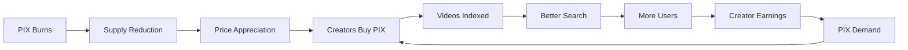

# Crypto/Web3 Funds

## Audience Profile
Crypto VCs are paradigm shifters and token economists. They've made fortunes betting on decentralization and aren't afraid of volatility. They understand mechanism design, token economics, and the power of community ownership. They value genuine utility over speculation, sustainable tokenomics over pump-and-dump. They're often former traders, protocol developers, or DeFi architects who see blockchain as the future of the internet. They think in terms of network effects, governance, and aligned incentives.

## Communication Fundamentals

### Body Language & Presence
- **Posture**: Relaxed confidence - you belong in Web3
- **Gestures**: Animated when discussing mechanisms
- **Eye Contact**: Engaged but casual - peer dynamics
- **Setting**: Flexible - Zoom/Discord as common as in-person

### Tone & Approach
- **Language**: Native crypto terminology, no translation
- **Pace**: Fast-paced, assume baseline knowledge
- **Style**: Technical depth with economic thinking
- **Culture**: Memes acceptable, suits optional

### Confidence Builders
- Understand Solana vs Ethereum trade-offs
- Know your token velocity and sink mechanisms
- Be familiar with successful Web3 creator projects
- Have on-chain metrics ready

## Key Value Propositions

### For Crypto/Web3 Funds
1. **Real Utility Token**
   - PIX has actual utility (video indexing)
   - Natural sink (consumed for processing)
   - No speculation needed
   - Sustainable economics

2. **Web3 Creator Economy Pioneer**
   - First true creator ownership platform
   - Blockchain-native monetization
   - Composable with DeFi
   - Open protocol potential

3. **Technical Innovation**
   - Solana optimization (compressed NFTs)
   - Novel staking mechanisms
   - Cross-chain architecture ready
   - Decentralization roadmap

## Token Economics Deep Dive

### PIX Token Design
```solidity
// Token Utility Model
TokenUtility {
    // Primary Utility: Video Processing
    VideoIndexing: {
        cost: "1M PIX per HD video",
        burn: "50% burned, 50% to rewards pool",
        demand: "Directly tied to platform usage"
    },
    
    // Secondary Utility: Priority Access
    SearchPriority: {
        stake: "Hold PIX for search benefits",
        boost: "10x PIX = 2x search relevance",
        lockup: "30-day minimum stake"
    },
    
    // Tertiary Utility: Governance
    Governance: {
        proposals: "1M PIX to propose",
        voting: "1 PIX = 1 vote",
        scope: "Fee structures, feature priority"
    }
}

// Token Distribution
Distribution {
    creators: 40%,      // Earned through platform
    investors: 20%,     // Vested 4 years
    team: 15%,         // Vested 4 years, 1 year cliff
    treasury: 15%,     // DAO-controlled
    ecosystem: 10%     // Grants and incentives
}
```

### Economic Flywheel


### Tokenomics Modeling
```python
# Supply/Demand Dynamics
class PIXEconomics:
    def __init__(self):
        self.total_supply = 10_000_000_000  # 10B PIX
        self.circulating = 1_000_000_000    # 1B initial
        self.burn_rate = 0.5                # 50% of usage burned
        self.daily_video_uploads = 10_000
        self.avg_pix_per_video = 5_000_000
    
    def daily_burn(self):
        usage = self.daily_video_uploads * self.avg_pix_per_video
        return usage * self.burn_rate
    
    def annual_deflation(self):
        daily = self.daily_burn()
        annual = daily * 365
        return annual / self.circulating  # 9.1% deflation
    
    def equilibrium_price(self, daily_usd_demand):
        # Velocity = 4 (quarterly video processing)
        market_cap_needed = daily_usd_demand * 365 / 4
        return market_cap_needed / self.circulating

# Model shows sustainable economics at scale
```

### DeFi Integration Opportunities
```yaml
Current Integrations:
  - Solana DEXs: Raydium, Orca liquidity pools
  - Lending: PIX collateral on Solend
  - Yield: Creator staking rewards
  - Payments: USDC/PIX atomic swaps

Future Opportunities:
  - Video NFTs: Fractional ownership
  - Creator Tokens: PIX-backed issuance
  - Prediction Markets: Video performance
  - Insurance: Creator earnings protection
  - Synthetic Assets: Video index funds
```

### Decentralization Roadmap
```
Phase 1 (Current): Centralized Bootstrap
- Team controls protocol
- Rapid iteration
- Foundation building

Phase 2 (2025): Progressive Decentralization
- Open source core contracts
- Community validators
- Governance token launch
- Treasury diversification

Phase 3 (2026): Protocol DAO
- Full on-chain governance
- Decentralized storage (Arweave)
- Multiple client implementations
- Protocol-owned liquidity

Phase 4 (2027+): Fully Autonomous
- Immutable core protocol
- Community development
- Cross-chain deployment
- Self-sustaining economics
```

## Web3-Native Features

### Creator Sovereignty
```javascript
// Creator-Owned Content Registry
class CreatorRegistry {
    // On-chain content ownership
    async registerVideo(videoHash, metadata) {
        const nft = await metaplex.nfts().create({
            uri: metadata.arweaveUrl,
            name: metadata.title,
            symbol: "PIXR",
            sellerFeeBasisPoints: 250, // 2.5% royalties
            creators: [{
                address: creatorWallet,
                verified: true,
                share: 100
            }]
        });
        
        return nft.address;
    }
    
    // Composable with other protocols
    async enableDeFi(nftAddress) {
        // Fractionalize for investment
        await fractional.split(nftAddress, 1000);
        
        // Enable lending
        await solend.whitelist(nftAddress);
        
        // Create liquidity pool
        await raydium.createPool(nftAddress, USDC);
    }
}
```

### Novel Staking Mechanisms
```rust
// Visibility Staking Program
pub mod visibility_staking {
    pub fn stake_for_boost(
        ctx: Context<StakeForBoost>,
        amount: u64,
        duration: i64,
    ) -> Result<()> {
        // Longer stakes = higher multipliers
        let multiplier = match duration {
            0..=30 => 1.0,
            31..=90 => 1.5,
            91..=180 => 2.0,
            181..=365 => 3.0,
            _ => 5.0,
        };
        
        // Lock tokens in escrow
        let stake_account = &mut ctx.accounts.stake;
        stake_account.amount = amount;
        stake_account.multiplier = multiplier;
        stake_account.unlock_time = Clock::get()?.unix_timestamp + duration;
        
        // Transfer to PDA
        token::transfer(
            ctx.accounts.into_transfer_context(),
            amount,
        )?;
        
        Ok(())
    }
}
```

## Common Questions & Answers

**Q: Why not fully decentralized from day one?**
A: Progressive decentralization works. Need product-market fit first. Uniswap, Compound followed same path. Decentralization roadmap clear.

**Q: Token seems like payment token, not investment?**
A: Utility drives value. MKR, UNI valuable due to utility. PIX has burn mechanism, staking rewards, governance rights. Investment characteristics emerge from utility.

**Q: How does this compare to other creator tokens?**
A: Rally, BitClout failed due to speculation focus. We solve real problem (discovery). Token has clear utility. Creators earn USDC, not volatile tokens.

**Q: Cross-chain plans?**
A: Solana-first for speed/cost. Bridge to Ethereum for DeFi composability. Evaluating Cosmos for interoperability. Architecture supports multi-chain.

**Q: Regulatory concerns?**
A: Utility token, not security. No investment promises. Decentralized over time. Legal opinion from a16z counsel. Similar to file storage tokens.

## Web3 Metrics & Analytics

### On-Chain Metrics
```python
# Current on-chain activity
on_chain_metrics = {
    "daily_transactions": 50_000,
    "unique_wallets": 15_000,
    "pix_burned_daily": 250_000_000,
    "staking_participation": 0.35,  # 35%
    "governance_participation": 0.12,
    "dex_liquidity": 5_000_000,  # $5M
    "holder_distribution": {
        "whales": 0.15,
        "dolphins": 0.35,
        "fish": 0.50
    }
}

# Comparative metrics
vs_competitors = {
    "transaction_cost": {
        "pixr": 0.00025,
        "ethereum": 5.00,
        "polygon": 0.01
    },
    "finality_time": {
        "pixr": 0.4,
        "ethereum": 12,
        "polygon": 2
    }
}
```

### Token Holder Analysis
```
Holder Segments:
├── Creators (40%)
│   ├── Active uploaders
│   ├── High PIX velocity
│   └── Long-term aligned
├── Investors (25%)
│   ├── Strategic holders
│   ├── Liquidity providers
│   └── Governance participants
├── Users (20%)
│   ├── Search power users
│   ├── Stakers for benefits
│   └── Speculators
└── Treasury (15%)
    ├── Ecosystem grants
    ├── Liquidity provision
    └── Emergency reserves
```

## Investment Structure

### Token Investment Terms
```yaml
Round: Series A Token Extension
Token Allocation: 5% of total supply
Vesting: 4 years, 1 year cliff
Price: $0.001 per PIX
Valuation: $10M FDV
Rights:
  - Board observation
  - Pro-rata in future rounds
  - Early liquidity options
  - Governance participation
```

### Web3 Fund Value-Add
```
Expected Contributions:
1. DeFi Protocol Introductions
   - Integration partnerships
   - Liquidity provision
   - Yield strategies

2. Web3 Marketing
   - KOL connections
   - Community building
   - Token launch strategy

3. Technical Advisory
   - Smart contract reviews
   - Tokenomics optimization
   - Security best practices

4. Ecosystem Connections
   - Exchange listings
   - Wallet integrations
   - Infrastructure partners
```

## Call-to-Action

### For Interested Web3 Funds
"We're building true Web3 creator economy infrastructure. Real utility, sustainable tokenomics, clear decentralization path. Let's discuss how you can join our token round."

### For DeFi Integration Partners
"PIX creates new DeFi primitives around creator content. Massive TVL opportunity. Our SDK makes integration trivial. Let's explore partnerships."

### For Web3 Advisors
"We need Web3-native thinking for our decentralization journey. Your expertise in tokenomics and governance would be invaluable. Advisor tokens available."

## Quick Reference

### Elevator Pitch (30 seconds)
"Pixr uses blockchain to let creators control their content discovery. PIX tokens fund video indexing with natural burn mechanism. Real utility meeting massive creator economy market."

### Token Metrics
- Total Supply: 10B PIX
- Initial Circulation: 1B
- Daily Burn: 250M (9% annual deflation)
- Current Price: $0.001
- FDV: $10M

### Web3 Credentials
- Solana mainnet live
- 50K+ daily transactions
- OtterSec audited
- Compound-style governance
- Progressive decentralization

### Ecosystem Position
- Creator Economy: First mover
- DeFi Integration: In progress
- Cross-chain: Roadmapped
- DAO Structure: 2025
- Protocol Revenue: $50K/month

Remember: Web3 funds think in network effects and token mechanics. Show them genuine utility, sustainable economics, and a path to decentralized governance. They want to fund protocols, not companies. Make Pixr feel like the foundation of Web3 creator economy.